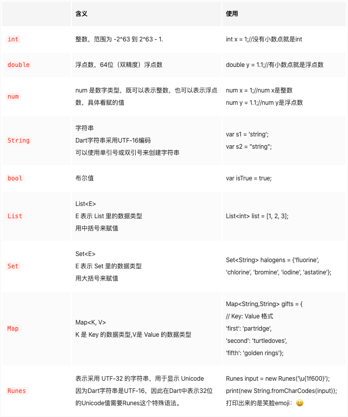
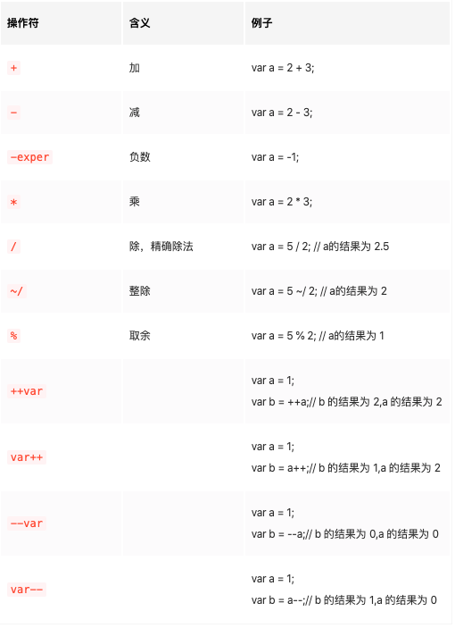
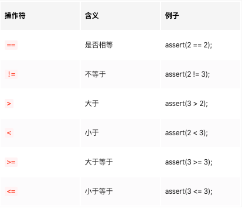
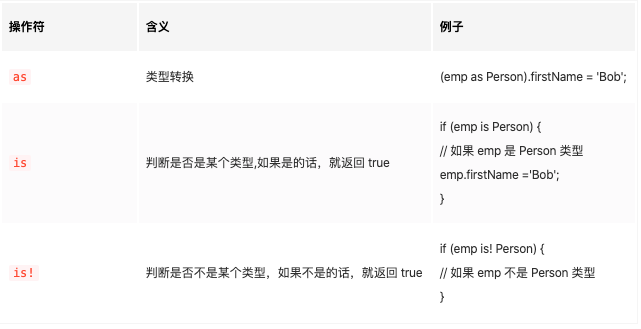
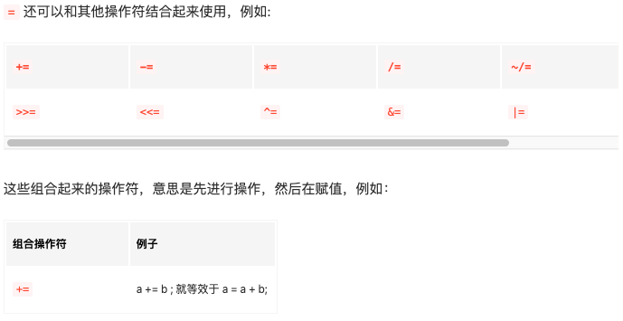
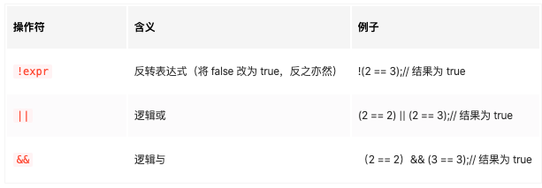
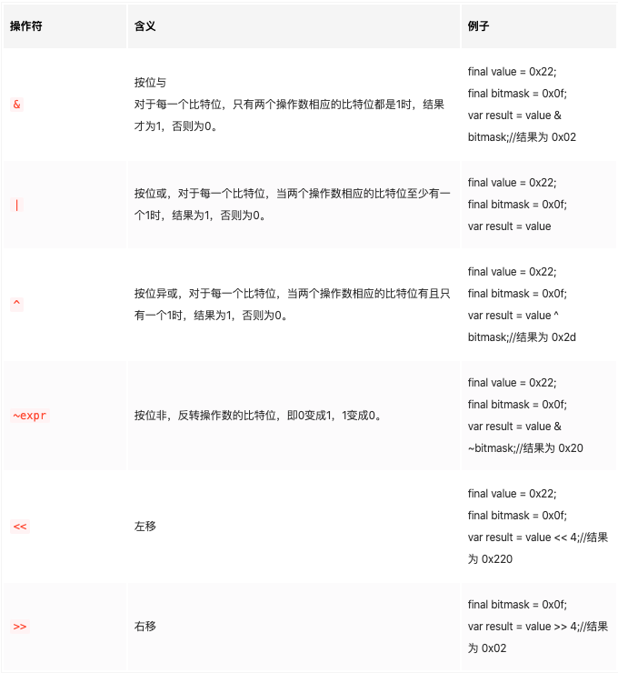
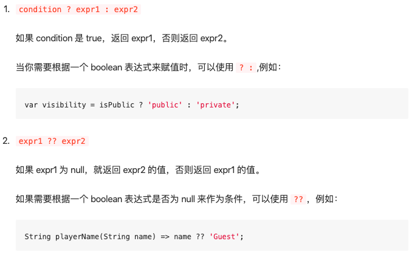
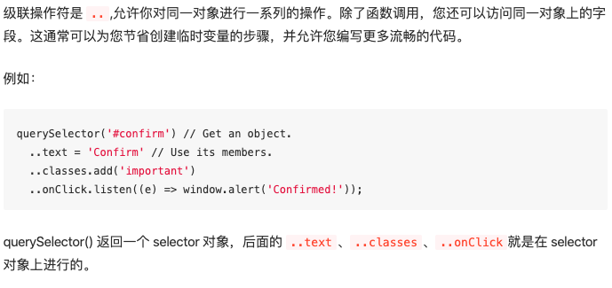
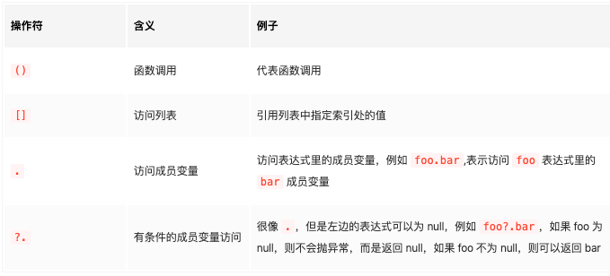

# dart学习笔记

## dart语言优势
> dart中的所有东西都是对象，包括数字、函数等，他们都继承自Object，并且对象的默认值都是null（包括数字）
> dart既支持 JIT（动态编译），也可以支持 AOT（静态编译）
> dart是强类型语言，但是由于dart可以推断类型，所以也可以支持动态类型，例如：var、dynamic

## dart用法
```
// 导入库
import 'package:flutter/material.dart';

/**
 * 入口函数
 */
void main() => runApp(MyApp());

/**
 * 定义一个 MyApp Widget
 */
class MyApp extends StatelessWidget {

    var content = 'Dart 语法'; // 声明并初始化变量
    String _name = "by 小德";

    @override
    Widget build(BuildContext context) {

        print('display $content');

        // return a Widget
        return MaterialApp(
            title: "Flutter Demo",
            theme: ThemeData(
                primaryColor: Colors.blue,
            ),
            home: Scaffold(
                appBar: AppBar(title: Text("Flutter Dart 语法")),
                    body: Text(content+_name)
                ),
        );
    }
}
```
* class、extends、import、注释（跟js一样）
* '.....' 或 "...." 字符串   使用跟js一样，同样适用于拼接
* `$variableName` 或 `${expression}`
    字符串插值：讲变量的值直接插入字符串中
    ```
    var aaa = 'sdfadfa';
    '$aaa ___' // sdfadfa ___
    '$aaa___' // error 因为dart会将 aaa___ 视为一个变量
    '${aaa}___'// sdfadfa___
    ```

## 变量声明
  * dart中变量的声明总共有4种
    1. 使用var来声明变量，不需要特别指定变量的数据类型，因为dart会自动推断其数据类型，所以可以使用var来定义任何的变量
          > 因为，var并不是直接存储值，而是存储值的对象的引用，所以var才能定义任何变量
    2. 明确数据类型
       ```
       String name = 'sdfadf';
       int count = 0;
       ```
    3. dynamic
       `dynamic example = 'example';`
       意思是数据类型是动态可变的，也可以定义任何的变量，但是和var不同的是，var一旦复制后，就不能改变数据类型了
    4. Object
       `Object index = 100;`
       dart里所有东西都是对象，是因为dart的所有东西都继承自Object，因此Object可以定义任何变量，而且复制后，类型可以更改
       ```
       注意：不要滥用dymic，一般情况下都可以用Object代替dynamic

       那什么情况下可以用 dynamic 呢？
        当这个变量无法用 dart 的类型来表示，比如Native喝Flutter交互，从Native传来的数据。
       ```
  * 常量：final 和 const
    * 使用 final 和 const 的时候可以把 var 省略
    * final 和 const 变量只能赋值一次，而且只能在声明的时候就赋值
    * const 是隐式的 final
    * 在使用 const 的时候，如果变量是类里的变量，必须加 static ，是全局变量时不需要加，例如：
        ```
        import 'package:flutter/material.dart';

        const demoConst = 'demo'; // 这里不用加 static

        void main() => runApp(MyApp());

        class MyApp extends StatelessWidget {
            static const content = 'Dart 语法'; // 这里必须要加 static
        }

        final 和 const 的区别
            const 是编译时常量，在编译的时候就初始化了，但是final变量是当类创建的时候才初始化
        ```

## dart支持的数据类型


## 函数
在 Dart 中函数也是对象，函数的类型是 Function。
```
// 函数写法
返回类型 函数名(函数参数){

}
bool say(String msg , String from, int clock){
  print(msg+" from " + from + " at " + clock?.toString());
  return true;
}
```
函数的参数：必选参数和可选参数
可选参数分为2种：
1.可选命名参数：使用 {} 包起来的参数是可选命名参数
2.可选位置参数：使用 [] 包起来的的参数是可选位置参数
```
// msg 必选参数
// from、clock 可选命名参数
bool say(String msg , {String from, int clock}){
  print(msg+" from " + from + " at " + clock?.toString());
  return true;
}
// say('Hello Flutter',from: 'XiaoMing',clock: 11);
// 可选命名参数，需要使用 map形式

// 在可选命名参数上加  @required，意思是这个也是必填参数
bool say(String msg , {@required String from, int clock}){
    print(msg+" from " + from + " at " + clock.toString();
    return true;
}
// say('Hello Flutter',from: 'XiaoMing',clock: 11);


// 可选位置参数
bool say(String msg , [String from , int clock]){
    print(msg+" from " + from + " at " + clock.toString();
    return true;
}
// say('Hello Flutter','XiaoMing',1);
// 跟js一样，一一对应

// 可选参数默认值 跟js一样，可以用 = 来为参数提供默认值
bool say(String msg , {String from = 'empty', int clock = 0}){
    print(msg+" from " + from + " at " + clock.toString();
    return true;
}
```

## 箭头语法
跟js一样

## 类 class
dart中每个对象都是一个类的实例，所有类都继承自Object
```
class Point{
    num, x, y;
    Point(num x, num y){
        this.x = x;
        this.y = y;
    }
}
```

## 操作符
dart中定义了很多的操作符，分为以下几类：
> 1. 算术运算符
> 
> 2. 比较操作符
> 
> 3. 类型判断符
> 
> 4. 赋值操作符
> 
> 5. 逻辑运算符
> 
> 6. 按位或移位运算符
> 
> 7. 条件运算符
> 
> 8. 级联操作符
> 
> 9. 其他操作符
> 