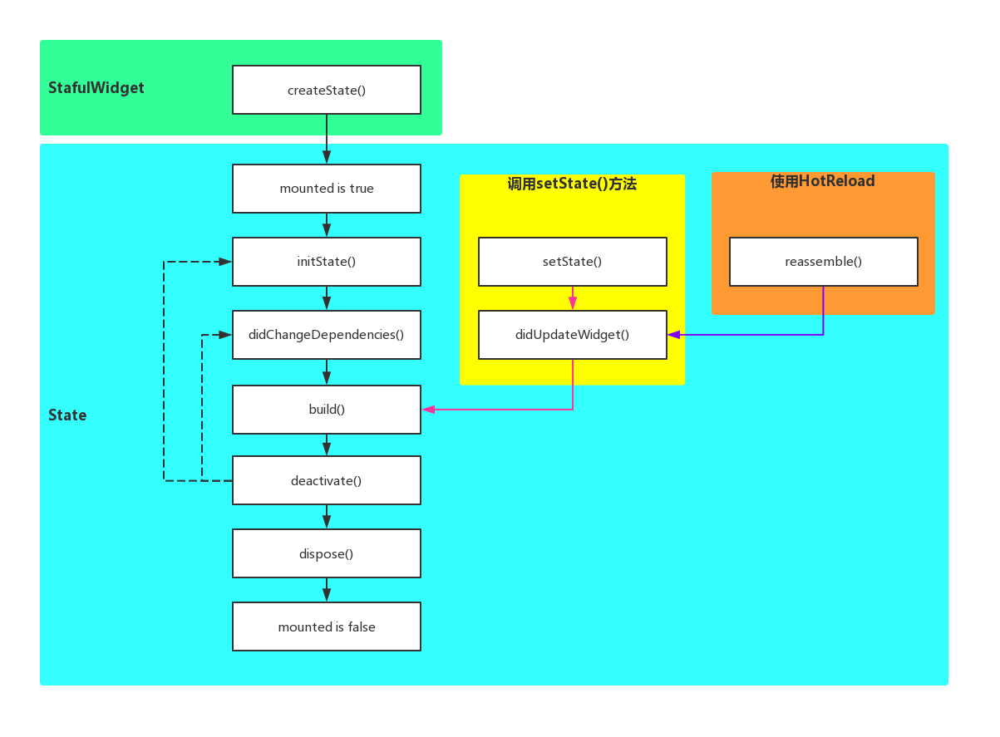

# Flutter的基础 --- widget

## widget 是什么
Flutter 中的 Widget 相当于 Android 里的 View，IOS里的 UIView

在Flutter中要用Widget构建UI。Flutter的Widget渲染采用

## widget的结构：widget树
widget组合的结构是树，所以也叫做widget树

##### 父widget和子widget
在widget树里，widget有包含和被包含的关系：
* 父widget：包含其他widget的就做父widget
* 子widget：被父widget包含的widget就做子widget
  
#### 根widget
根widget也叫root widget
```
void main() => runApp(MyApp());
```
runApp(MyApp())里的参数MyApp()就是一个widget，MyApp的作用只是封装一下，实际使用的widget是 MaterialApp， 这里的MateriakApp 就是根Widget，Flutter会默认把根widget充满屏幕

在Flutter中，根Widget只能是以下三个：
* WidgetsApp：
    widgetsApp是可以自定义风格的根widget

* MaterialApp：
    MaterialApp 是在 widgetsApp上添加了很多 materiak-design的功能，是Material Design风格的根widget

* CupertinoApp：
    CupertinoApp 也是基于widgetsApp 实现的 IOS风格的根widget

这三个中最常用的是 MaterialApp，因为MaterialApp的功能最完善。MaterialApp经常与Scaffold一起使用

## widget的标识符：key
为了在diff过程中，知道widget有没有变化，就需要给widget添加一个唯一的标识符，然后在widget树的diff过程中，查看刷新前后的widget树有没有相同标识符的widget，如果标识符相同，则说明widget没有变化，否则说明widget有变化

##### Flutter中如何在diff过程中判断哪些widget没有变化
Flutter判断哪些widget没有变化，主要有两种情况：
* 默认情况（widget没有设置key）：
    当没有给widget设置key时，Flutter会根据widge的runtimeType喝显示顺序是否相同来判断widge是否有变化

    runtimeType是widget的类型，例如Text喝RaisedButton就是不同的类型

* widget 有key：
    当给widget设置了key时，Flutter是根据key和runtimeType是否相同来判断widget是否有变化

##### key的分类
key总共分为两类：
1. Local Key（局部key）
    > 在有相同级的widget钟，key是唯一的，这样的key叫做局部key
    > 可以作为key的值：
    > * Object key 将对象作为key的值
    > * value key 使用特定类型的值作为key的值
    > * uniqueKey  使用 uniqueKey 自己的对象作为key的值，所以只能与自身相等，称为唯一key
2. Global Key （全局key）
    > 全局key是在整个App中唯一的key
    > 全局key在Flutter中对应的抽象类是GlobalKey。GlobalKey有不同的实现，主要是使用场景不同：
    > * LabeledGlobalKey   LabeledGlobalKey 用于调试，不会用来比较widget是否变化
    > * GlobalObjectKey   将对象作为 Global key 的值

一般情况下我们不需要使用key，但是当页面比较复杂时，就需要使用key去提升渲染性能

## widget的分类：StatelessWIDget 和 StatefulWidget
因为渲染是很耗性能的，为了提高Flutter的帧率，就要尽量减少不必要的UI渲染，所以Flutter根据UI是否有变化，将widget 分为：
* StatefulWidget：
    StatefulWidget 是UI可以变化的widget，创建完后UI还可以在更改
* StatelessWidget：
    StatelessWidget 是UI不可以变化的widget，创建完后UI就不可以在更改


## Flutter中widget的使用
我们在Flutter中使用widget的时候，有以下两点：
1. StatefulWidget 与 StatelessWidget
    Flutter的大部分widget都可以分为StatefulWidget 和 StatelessWidget 这两类，所以要弄懂 StatefulWidget 和 StatelessWidget的区别和使用范围

2. MaterialApp 与 Scaffold
    MaterialApp 大部分情况下要作为Flutter的根Widget，并且MaterialApp经常和Scaffold搭配一起使用

## StatefulWidget 及 State
StatefulWidget 是UI可以变化的widget

### 1.StatefulWidget
```
class MyApp extends StatefulWidget {

  String content;

  MyApp(this.content);

  @override
  State<StatefulWidget> createState(){
    return MyAppState();
  }

}
```
StatefulWidget实现步骤：
> 1. 首先继承StatefulWidget
> 2. 实现createState() 的方法，返回一个 State
##### StatefulWidget的功能
StatefulWidget的主要功能就是创建State

### 2.State
state即是状态
```
class MyAppState extends State<MyApp> {
  bool isShowText = true;

  void increment(){
    setState(() {
      widget.content += 'd';
    });
  }

  @override
  Widget build(BuildContext context) {
    return ...;
  }
}
```

State的实现步骤
> 1. 首先继承State，State的泛型类型是上面定义的Widget的类型
> 2. 实现 build() 的方法，返回一个Widget
> 3. 需要更改数据，刷新UI的话，调用setState()

#### State的定义
State用到了泛型，它的定义是这样子的：

    `State<T extends StatefulWidget>`

#### State的功能
State有两个功能呢：
> 1. build() ---- 创建Widget
> 2. setState() ---- 刷新UI

##### 1.build() --- 创建widget
State的build 函数创建widget，用于显示UI

##### 2.setState ---- 更新状态，刷新UI
调用setState 方法，在setState 里更改数据的值，然后setState 会触发State的build方法，引起强制重建Widget，在重建Widget的时候回重新绑定数据，而这时数据已经发生变化，从而达到刷新UI的目的。
> 这里要注意，更改数据的代码，必须在 setState之前写，或者在setState内的无参函数里写，才能刷新数据，否则是没有用的
> 
> setState可以刷新UI的原理是，setState会触发StatefulWidget强制重建，所以只要MyApp是StatefulWidget，那么它的自雷在setState的作用下都可以呗强制刷新

#### State的成员变量
State里面有三个重要的成员变量：
> 1. widget
    它的类型是Widget。widget可以访问StatefulWidget中成员变量
> 2. context
    它的类型是BuildContext
    `Widget build(BuildContext context)`
    buildContext 是Flutter里的重要概念
> 3. mounted
    mounted 是 bool 类型，表示当前State是否加载到树里。State对象创建之后，initState创建之前，framework 通过与 BuildContext 相关联，来将State对象加载到树中，此时mounted会变成true，当State dispose之后，mounted就会变成false
    setState只有在mounted为true的时候才能用，否则会抛异常

#### 为什么StatefulWidget 被分成 StatefulWidget 和 State两部分？
一方面是为了保存当前APP的状态，另一个重要的原因就是为了性能

当ui需要更新的时候，加入Widget和State都重建，可是State里保存了UI显示的数据，State重建，创建新的实例，UI之前的状态就会丢失，导致UI显示异常，所以要分成两部分，一部分重建，一部分不会重建，重建的部分就是StatefulWidger，不会重建的部分就是State

Widget重建的成本很低，但State的重建成本很高，因此将StatefulWidget分成两部分：重建成本低的Widget和重建成本高的State。这样就使得State不会被频繁重建，也就提高了性能

##### StatefulWidget的重新定义
StatefulWidget是有State的Widget，当Widget在运行需要改变时，就要用StatefulWidget

##### StatefulWidget的生命周期
因为StatefulWidget由StatefulWidget和State两部分组成，所以也有StatefulWidget的生命周期和State生命周期


#### StatelessWidget
StatelessWidget是没有State的Widget，当Widget在运行时不需要改变，就用StatelessWidget

##### StatelessWidget的实现
```
void main() => runApp(MyApp('Hello Word'));

class MyApp extends StatelessWidget {

  String content;

  MyApp(this.content);

  @override
  Widget build(BuildContext context){
    return MaterialApp(
      title: 'Flutter Demo',
      theme: ThemeData(
        primarySwatch: Colors.blue
      ),
      home: Scaffold(
        body: Center(
          child: Text(content),
        ),
      ),
    );
  }

}
```
要实现自定的StatelessWidget
1. 必须要继承StatelessWidget
2. 必须要实现 build 函数，返回一个Widget

##### StatelessWidget：immutable（状态不可变）
StatelessWidget是没有State的，而且StatelessWidget只能在加载/构建Widget时才绘制一次，这意味着无法基于任何事件或用户操作重绘StatelessWidget

### MaterialApp与Scaffold
在写Flutter App的UI时，都必须要用到这两个
* MaterialApp
    MaterialApp 表示当前应用的风格是Material Design。为了使用其他已经封装好的Material Design风格的Widget，就必须使用MaterialApp。因此MaterialApp经常是Flutter Widget树里的第一个元素，就是 Root Widget

* Scaffold
    Scaffold实现了Material Design的基本布局结构，例如 AppBar、Drawer、SnackBar等，所以为了使用这些布局，也必须要使用Scaffold，所以一个Flutter App的基本结构就是 Root Widget是MaterialApp，然后MaterialApp的子Widget就是Scaffold，然后我们在Scaffold的子Widget里写UI

#### MaterialApp 使用
* title
    Sting类型（暂未发现有啥用处）
    这个title是出现在Android的任务管理器上或者是ios切换管理器中
* color
    Color 类型
    该颜色为Android的任务管理器中应用图标背景的颜色
* theme
    ThemeData 类型
    设置Flutter App的主题，比如颜色、字体等
* home
    Widget  类型（核心）
    进入程序后显示的第一个页面，必须是Scaffold

#### Scaffold 使用
Scaffold是实现Material Design基本视觉布局结构的Widget，它被设计为MaterialApp的顶级容器，会自动填满屏幕，并且会自动设配不同的屏幕，例如刘海屏等

* appBar
    AppBar类型
    就是顶部的标题栏，不设置的话就不会显示
    `appBar: new AppBar(title: Text('Flutter Demo'))`
* backgroundColor
    Color类型
    背景颜色

* body
    Widget类型
    就是Scaffold要显示的内容
    body是Widget类型，是Scaffold的最重要的属性，也是实际要显示的UI
    ```
    body: Center(
        child: Text(content),
    ),
    ```

### Widget的深度理解

#### Everything is a Widget
在Android中，UI显示的容器是Activity，Ios显示UI的容器是ViewController，在Flutter，这些都是Widget的功能，Widget不仅是View，也是Flutter UI的容器，而且布局也是使用的Widget，监听点击事件也是Widget，实现动画也是Widget，设置padding也是用Widget，设置透明度也是用Widget，所以说Everything is a Widget

#### 组合大于继承
在Android中，要想实现自定义的view时，都是实现一个view的子类，或者继承已有的view。ios也是同样的，要想实现自定义的view时，要么实现一个UIView，或者继承已有的UIView

但在Flutter 中，要实现一个自定义的Widget，最好通过组合其他Widget来实现，而不是用继承

因为在Flutter中，Widget组合大于继承

#### widget的使用方法
因为Widget有上百个，而且我们经常用到的不多，大致可以分为以下五类：
* 基础Widget
* 手势识别Widget
* 布局Widget
* 容器类Widget
* 可滚动Widget

#### 受用Widget的步骤
1. 先找到Widget的构造函数
2. 看构造函数哪些参数是可选的，哪些参数是可选的，必选的参数必须要复制，可选的根据需要来复制
3. 为了更灵活的使用Widget，需要知道Widget每个参数的作用和使用方法


### flutter异步编程
首先，flutter 跟 js一样都是属于单线程程序，但是却是可以进行异步操作的
dart代码运行的环境叫 lsolate，dart代码默认跑在 root lsolate上
当 dart代码正在运行时，同一个lsolate中的其他代码无法同时运行
flutter可以拥有多个lsolate，但 lsolate 之间不能共享内存

#### flutter写异步的方式
* async 和 await
    async 和 await 跟 js 的用法一样，await只能在 async 的方法中使用
    ```
    void _getData() async {
        List<HotMovieData> serverDataList = new List();
        var response = await http.get();
        .....
    }
    ```
    在执行到 await 关键词的时候，代码会暂停运行，直到 complete Future object 返回

* 使用the方法
    ```
    void gather() {
        gatherNewsReports().then(...);
    }

    Future<String> gatherNewsReports(){
        ...
    }
    ```