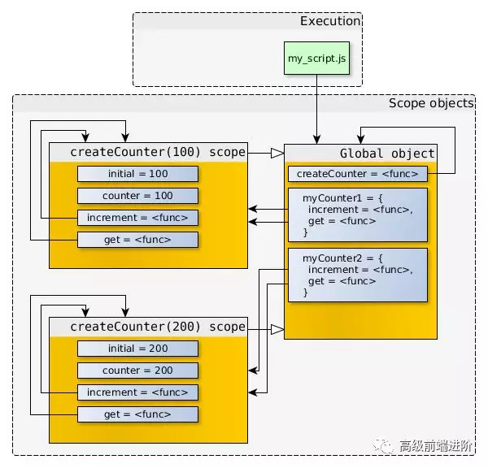
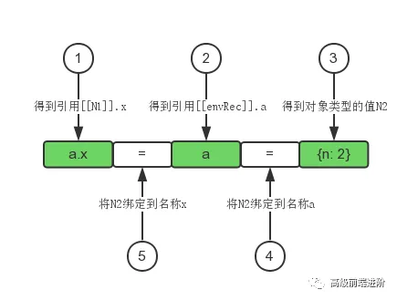
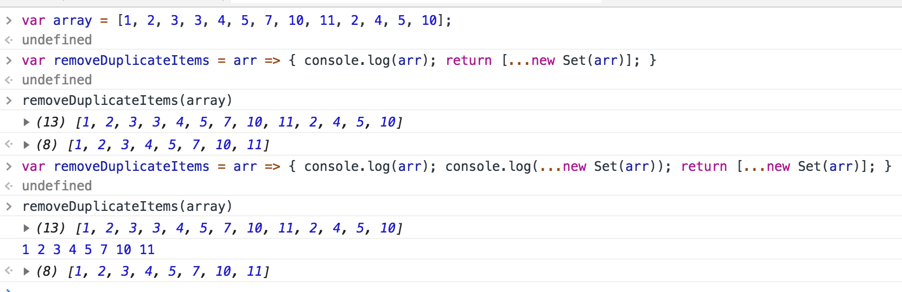

### 11月每日阅读总结

### 2018-11-30
* [JavaScript深入之重新认识箭头函数的this](https://github.com/yygmind/blog/issues/21)
    * 箭头函数不绑定this，箭头函数中的this相当于普通变量
    * 箭头函数的this寻值行为与普通变量相同，在作用域中逐级寻找
    * 改变作用域中this的指向可以改变箭头函数的this

### 2018-11-29
* [JavaScript深入之史上最全--5种this绑定全面解析](https://github.com/yygmind/blog/issues/20)
    * this的绑定方式：
        * 默认绑定（严格/非严格模式）
        * 隐式绑定
        * 显式绑定
        * new绑定
        * 箭头函数绑定
    * 绑定规则
        * 默认绑定
            * 独立函数调用，可以把默认绑定看作是无法应用其他规则时的默认规则，this指向全局对象
            * 严格模式下，不能将全局对象用于默认绑定，this会绑定到 undefined 。只有函数运行在非严格模式下，默认绑定才能绑定在全局对象。在严格模式下调用函数则不影响绑定
            ```
            function foo(){
                "use strict";
                console.log(this.a); // TypeError: Cannot read property 'a' of undefined
            }
            var a = 2;
            foo();
            
            // --------------------
            function foo(){
                console.log(this.a); // 2
            }
            var a = 2;

            (function(){
                "use strict";

                foo();
            })();
            ```
        * 隐式绑定
            * 当函数引用有上下文对象时，隐式绑定规则会把函数中的this绑定到这个上下文对象。对象属性引用链中只有上一层或者说最后一层在调用中起作用
        * 显示绑定
            * 通过 call、apply、bind 方法。第一个参数是一个对象，在调用函数时将这个对象绑定到this。因为直接指定this的绑定对象，称之为显式绑定
        * new绑定
            * 构造一个对象并把它绑定到 方法调用中的this
    * 优先级
        * new绑定 > 显式绑定 > 隐式绑定 > 默认绑定
    * 绑定例外
        * 把 null 或者 undefined 作为 this 的绑定对象传入 call、apply、bind 这些值在调用时会被忽略，实际应用的是默认规则
        * 间接引用下，调用这个函数会应用默认绑定规则。间接引用最容易在赋值时发生

        ```
        function foo(){
            console.log( this.a );
        }
        var a = 2;
        var o = { a: 3, foo: foo };
        var p = { a: 4 };

        o.foo(); // 3
        // p.foo = o.foo的返回值是目标函数的引用，所以调用位置是foo()而不是p.foo()或者o.foo()
        (p.foo = o.foo)(); // 2
        ```
        * 软绑定：
            * 硬绑定可以把this绑定到指定的对象（new除外），防止函数调用应用默认绑定规则。但是会降低函数的灵活性，使用硬绑定之后就无法使用隐式绑定或者显示绑定来修改this
            * 如果给默认绑定指定一个全局对象和undefined以外的值，那就可以实现和硬绑定相同的效果，同时保留隐式绑定或者显示绑定修改this的能力
    * this词法
        * es6新增一种特殊函数类型：箭头类型，箭头函数无法使用上述四条规则，而是根据外层（函数或者全局）作用域（词法作用域）来决定this
        * 箭头函数的绑定无法修改（new也不行）

### 2018-11-28
* [JavaScript深入之闭包面试题解](https://github.com/yygmind/blog/issues/19)
    * 作用域链是一个对象列表或者对象链，它保证了变量对象的有序访问
    * 常见闭包解决方案中，无论是使用即调函数，还是采用缓存匿名函数的做法，本质上都是通过 匿名函数，来做一层 AO的传递，使 参数缓存一份

### 2018-11-27
* [JavaScript深入之从作用域链理解闭包](https://github.com/yygmind/blog/issues/18)
    * 闭包总结起来就是2点
        * 是一个函数（比如，内部函数从父函数中返回）
        * 能访问上级函数作用域中的变量（哪怕上级函数上下文已经销毁）
    * 闭包最终还是执行作用域链相关原则来进行查询 变量，而 作用域链是一个 数组，[当前AO，上级AO，.....，全局AO]这样的顺序来进行查找

### 2018-11-26
* [深入浅出图解作用域链和闭包](https://mp.weixin.qq.com/s/qZ1fYcJQEpD3O9bXOAQx0Q)
    * 作用域链：
        * 当访问一个变量时，解释器会首先在当前作用域查找表示符，如果没有找到，就去父级作用域找，知道找到该变量的标识符或者不在父级作用域中，这就是作用域链
        * 从作用域链看闭包

        ```
        "use strict";
        function createCounter(initial) {
            var counter = initial;

            function increment(value) {
                counter += value;
            }

            function get() {
                return counter;
            }

            return {
                increment: increment,
                get: get
            };
        }
        //-- create counter objects
        var myCounter1 = createCounter(100);
        var myCounter2 = createCounter(200);
        ```
        

        * 闭包能够存贮私有数据

### 2018-11-23
* [JavaScript深入之4类常见内存泄漏及如何避免](https://mp.weixin.qq.com/s/RZ8Lpkyk8lz6z5H8Q8SiEQ)
    * 四种常见的js内存泄漏
        * 1、意外的全局变量：
            * 未定义的变量会在全局对象创建一个新变量 (非严格模式下，严格模式下会直接报错)
            * 另一个意外的全局变量可能是由 this 创建的。( 当this指向的是全局的情况下，this.xxx = 'xxx'; 这样就会创建了一个全局变量 )
            * 解决方法：
                * 使用严格模式  'use strict' 避免意外的全局变量，在 严格模式下，全局方法的 this 会指向 undefined 而不是 window
        * 2、被遗忘的计时器或回调函数
            * 忘记清除的 setInterval
        * 3、脱离dom的作用
            * 如果把dom存成字典（json键值对）或者数组，此时，同样的dom元素存在两个引用：一个在dom树中，另一个在字段中。那么将来需要把两个引用都清除
            
            ```
            var elements = {
                button: document.getElementById('button'),
                image: document.getElementById('image'),
                text: document.getElementById('text')
            }
            function removeButton() {
                // 按钮是 body 的后代元素
                document.body.removeChild(document.getElementById('button'));
                // 此时，仍旧存在一个全局的 #button 的引用
                // elements 字典。button 元素仍旧在内存中，不能被 GC 回收。
            }
            ```
        * 4、闭包
            * 闭包的关键是匿名函数可以访问父级作用域的变量

            ```
            var theThing = null;
            var replaceThing = function(){
                var originalThing = theThing;
                var unused = function () {
                    if (originalThing)
                    console.log("hi");
                };

                theThing = {
                    longStr: new Array(1000000).join('*'),
                    someMethod: function () {
                    console.log(someMessage);
                    }
                };
            }
            setInterval(replaceThing, 1000);
            ```
            * 每次调用 replaceThing，theThing 得到一个包含大数组和一个新闭包(someMethod)的对象。同事变量 unused 是一个引用了 originalThing的闭包。someMethod 可以通过 theThing 使用，someMethod 与 unused 分享闭包作用域，尽管 unused 从未使用，它引用的 originalThing 迫使它保留在内存中（防止被回收）。
            * 解决方法：
                * 在 replaceThing，theThing 的最后添加  originalThing = null; 进行清空
    * 思考题：
        * 代码的执行结果是什么？

        ```
        <script>
            console.log(fun) // throw fun is not defined

            console.log(person) // 前面报错拦截  不输出
        </script>

        <script>
            console.log(person) // undefined

            console.log(fun) // function

            var person = "Eric";

            console.log(person) // Eric

            function fun() {
                console.log(person) // undefined
                var person = "Tom";
                console.log(person) // Tom
            }

            fun()

            console.log(person) // Eric
        </script>
        ```

### 2018-11-22
* [面试必备：JS花式继承](https://mp.weixin.qq.com/s/GfZF9VAbGqPxxhDpnWOMpQ)
    * class继承(ES6)
        * es6继承很简洁，原理 是  es5的原型链继承的语法糖，一样拥有 原型链继承的缺点，就是方便点而已
    
        ```
        // 父类
        class A{
            constructor(r){
                this.r = r;
            }
        }
        // 子类
        class B extends A{
            constructor(r){
                super(r);// 固定写法，调用父类的构造方法
                this.color = 'red';
            }
        }
        ```
    * 原型链继承
        * 缺点：
            * 引用类型的属性会被所有实例共享
            * 创建子类型实例时不能给超类型传参
        
        ```
        // 父类
        function Super() {
            this.prop = true;
        }
        Super.prototype.getSuperValue = function() {
            return this.prop;
        }
        // 子类
        function Sub() {
            this.subProp = false;
        }
        Sub.prototype = new Super(); // 继承
        Sub.protorype.getSubValue = function() {
            return this.subProp;
        }
        ```
    * 构造函数继承
        * 优点：
            在子类构造器内部调用超类构造函数即可解决引用类型值的问题，同事还能向超类传参
        * 缺点：
            * 在超类原型中定义的方法，对子类是不可见的
        
        ```
        function Super(name){
            this.colors = ['red', 'blue', 'green'];
            this.name = name;
        }
        function Sub(){
            Super.call(this, 'Sub');
        }
        ```
    * 组合继承 构造函数继承 + 原型链继承
        * 融合原型链继承 和 构造函数继承的优点，是目前js 最常用的继承模式

        ```
        function Super(name){
            this.colors = ['red', 'blue', 'green'];
            this.name = name;
        }
        Super.prototype.sayName = function(){
            console.log(this.name);
        }
        function Sub(name, age){
            Super.call(this, name);
            this.age = age;
        }
        Sub.prototype = new Super();
        Sub.prototype.constructor = Sub; // 修正Sub函数引用，重定向回 Sub
        Sub.sayAge = function(){
            console.log(this.age);
        }
        ```
    * Object.create类式继承
        * 

        ```
        function Shape(){
            this.x = 0;
            this.y = 0;
        }
        Shape.prototype.move = function(x,y){
            this.x += x;
            this.y += y;
            console.info('Shape moved')
        }

        function Rectangle(){
            Shape.call(this); // call super constructor.
        }

        Rectangle.prototype = Object.create(Shape.prototype);

        var rect = new Rectangle();

        rect instanceof Rectangle // true
        rect instanceof Shape // true

        rect.move(1, 1); // Shape moved
        ```
    * 原型式继承
        * 基本用于没必要创建构造函数，只想一个对象和另一个对象保持相似的情况
        * 不过和原型链模式一样，引用类型的属性会被共享
        * es5的 Object.create 的模拟实现

        ```
        function object(o){
            function F(){}
            F.prototype = o;
            return F();
        }
        ```
    * 寄生式继承
        * 创建一个仅用于封装继承过程的函数，该函数在内部以某种形式来做增强对象，最后返回对象。
        * 跟构造函数模式一样，每次创建对象都会创建一遍方法

        ```
        function createAnother(original){
            var clone = Object.create(original);
            clone.sayHi = function(){
                consoloe.log('Hi')
            }
            return clone
        }
        ```
    * 寄生组合式继承
        * 组合式继承在使用的时候至少会调用两次超类的构造函数(call一次，new一次)
        * 寄生组合式继承避免了 new 操作再执行一次构造函数并在子类prototype上添加一些不必要的属性
        * 被高程推荐为  引用类型最理想的继承范式

        ```
        function inheritPrototype(Sub, Super){
            var prototype = Object.create(Super);
            prototype.constructor = Sub;
            Sub.prototype = prototype;
        }
        function Super(name){
            this.colors = ['red', 'blue', 'green'];
            this.name = name;
        }
        Super.prototype.sayName = function(){
            console.log(this.name);
        }
        function Sub(name, age){
            Super.call(this, name);
            this.age = age;
        }
        inheritPrototype(Sub, Super);
        Sub.sayAge = function(){
            console.log(this.age);
        }
        ```

* [JavaScript深入之带你走进内存机制](https://mp.weixin.qq.com/s/yK4DPKhkmkiroasWJMrJcw)
    * js内存空间分为 栈(stack)、堆(heap)、池(一般也会归类为 栈中)。其中 栈 存放变量，堆 存放复杂对象，池 存放常量，所以也叫常量池
    * 闭包中的变量并不是保存在 栈内存 中，而是保存在 堆内存 中，这也就解释了函数之后为什么闭包还能引用到函数内的变量
    * 内存回收
        * js 有自动垃圾收集机制，垃圾收集器会每隔固定的时间段就执行一次释放操作，找出那些不再继续使用的值，然后释放其占用的内存
        * 局部变量和全局变量的销毁
            * 局部变量：局部作用域中，当函数执行完毕，局部变量也就没有存在的必要了，因此垃圾收集器很容易做出判断并回收
            * 全局变量：全局变量什么时候需要自动释放内存空间则很难判断，所以在开发中尽量 避免 使用全局变量
        * v8引擎汇总所有的js对象都是通过 堆 来进行内存分配的
            * 初始分配：当声明变量并赋值时，v8引擎就会在堆内存中分配给这个变量
            * 继续申请：当已申请的内存不足以存储这个变量时，v8引擎就会继续申请内存，直到 堆 的大小达到v8引擎的内存上限为止
        * v8引擎对 堆内存 中的js对象进行分代管理
            * 新生代：存活周期较短的js对象，如临时变量、字符串等
            * 老生代：经过多次垃圾回收仍然存活，存活周期较长的对象，如 主控制器、服务器对象等
        
        * (我猜想 在js 内部应该是 优先将 所有的变量定义为新生代，在经过每次垃圾回收的时候，做标记累加，达到上限值，从新生代移动到老生代中。而 系统提供的默认对象，应该都是存在于 老生代中，如：window、document等)

    * 垃圾回收算法：
        * 对垃圾回收算法来说，核心思想就是如何判断内存已经不再使用，常用垃圾回收算法有2种：
            * 引用计数（现代浏览器不再使用）
            * 标记清除（常用）
        * 引用计数：
            * 引用计数算法定义”内存不再使用“的标准很简单，就是看一个对象是否有指向它的引用。如果没有其他对象指向它了，说明该对象已经不再需要了。

            ```
            // 创建一个对象person，他有两个指向属性age和name的引用
            var person = {
                age: 12,
                name: 'aaa'
            }

            person.name = null; // 虽然name设置为null，但因为person对象还有指向name的引用，因此name不会回收

            var p = person;
            person = 1; // 原来的person对象被赋值为1，但因为有新的引用p指向原 person 对象，因此它不会被回收

            p = null; // 原person对象已经没有引用了，很快就会被回收
            ```
            * 引用计数有一个致命的问题，那就是 循环引用。如果两个对象相互引用，尽管他们已不再使用，但是垃圾回收器不会进行回收，最终可能会导致内存泄漏

            ```
            funciton cycle(){
                var o1 = {};
                var o2 = {};
                o1.a = o2;
                o2.a = o1;

                return 'cycle reference!';
            }
            ```
            * cycle 函数执行完毕之后，对象 o1 和 o2 实际上已经不再需要了，但根据引用计数的原则，他们之间的相互引用依然存在，因此这部分内存不会被回收。所以现代浏览器不再使用这个算法
            * IE 依旧使用
        * 标记清除
            * 标记清除算法将”不再使用的对象“定义为 “无法到达的对象”。即从根部（在js中就是全局对象）出发定时扫描内存中的对象，凡是能从根部到达的对象，保留。那些从根部出发无法触及到的对象被标记为 不再使用，稍后进行回收

        * 现代的垃圾回收器改良了算法，但是本质是相同的：可达内存被标记，其余的被当做垃圾回收

    * 内存泄漏
        * 对于不再用到的内存，没有及时释放，就叫做内存泄漏
    * 内存泄漏识别方法
        * 浏览器方法
            * 1、打开开发者工具，选择 Memory
            * 2、在右侧的Select profiling type字段里面勾选 timeline
            * 3、点击左上角的录制按钮。
            * 4、在页面上进行各种操作，模拟用户的使用情况。
            * 5、一段时间后，点击左上角的 stop 按钮，面板上就会显示这段时间的内存占用情况
        * 命令行方法
            * 使用 node 提供的 process.memoryUsage方法
        * weakMap
            * ES6 新出的两种数据结构：WeakSet 和 WeakMap，表示这是弱引用，他们对于值的引用都是不计入垃圾回收机制的

            ```
            const wm = new WeakMap();
            const element = document.getElementById('examle');

            wm.set(element, 'some information');
            wm.get(element); // some information
            ```
    * 思考题
        * 从内存来看 null 和 undefined 本质的区别是什么？
            * null 表示已经不需要内存空间了
            * undefined 只是 变量的值为 undefined，还是占用着 内存空间的

            * 2018-11-23 解读：
                * 如果是给一个全局变量赋值为 null，相当于将这个变量的指针对象以及值清空。
                * 如果是给对象的属性赋值为 null，或者局部变量赋值为 null，相当于给这个属性分配了一块空的内存，然后值为null，js会回收这全局变量为null的对象
        * es6语法中 const 声明一个只读的常量，那么为什么下面可以修改const的值？
            
            ```
            const foo = {};
            foo = {}; // TypeError: "foo" is read-only
            foo.prop = 123;
            foo.prop; // 123
            ```
            * 首先因为 对象是属于引用类型，是存在于 堆内存中的，在 栈内存中，存储的是一个 固定长度的 内存地址串。
            * const 只是将 栈内存中的变化给与禁止了。
            * 但是堆内存中的更改并没有去进行监控禁止。
        * 哪些情况下容易产生内存泄漏
            * dom的事件绑定处理、递归、循环。


### 2018-11-21
* [JavaScript深入之内存空间详细图解](https://mp.weixin.qq.com/s/x4ZOYysb9XdT1grJbBMVkg)
    * 在某些时候，调用堆栈中函数调用的数量超过了调用堆栈的实际大小，浏览器会抛出一个错误终止运行
        * 通常发生在 循环、递归中。堆栈的实际大小，这个是浏览器定义的
    * 栈数据结构：
        * 之前有提到过 是 LIFO 的结构（后进先出）
    * 堆数据结构：
        * 堆数据结构是一种树状结构。它的存取数据的方式与书架和数非常相似。我们只需要知道书的名字就可以直接取出书了，并不需要把上面的书都取出来
    * 变量的存放：
        * 内存中有栈和堆，那么变量应该存放在哪里呢，堆？栈？
            * 基本类型 --> 基本类型 是保存在 栈内存 中，因为这些类型在内存中分别占用固定大小的空间，通过按值来访问。基本类型一共有6种：Undefined、Null、Boolean、Number、String、Symbol
            * 引用类型 --> 保存在 堆内存 中，因为这种值的大小不固定，因此不能把他们保存到栈内存中，但内存地址大小是固定的，因此保存在堆内存中，在栈内存中存放的只是该对象的访问地址。
            先从 栈中读取内存地址，然后再通过地址找到堆中的值。我们一般称呼为 引用访问
    * 内存空间管理
        * 分配你所需要的内存
        * 使用分配到的内存（读、写）
        * 不需要时将其释放、归还
    * 思考题：

        ```
        var a = {n: 1};
        var b = a;
        a.x = a = {n: 2};

        a.x     // 这时 a.x 的值是多少
        // undefined
        b.x     // 这时 b.x 的值是多少
        // {n:2}
        // . 运算符的优先级 同  [] ()
        // 所以先运行 a.x = {n: 2}
        // 再运行 a = {n: 2}
        ```
        * 2018-11-22 补充：
            * 1、优先级。. 的优先级高于 = ，所以先执行 a.x，堆内存中的 {n: 1} 就会变成 {n: 1, x: undefined}，改变之后相应的 b.x 也变化了，因为指向的是同一个对象。
            * 2、赋值操作是 从右到左， 所以先执行 a = {n: 2}， a 的引用就被改变了，然后这个返回值又赋值给了 a.x， 需要注意的是 这时候 a.x 是第一步中的 {n: 1, x: undefined}，那个对象，其实就是 b.x，相当于 b.x = {n: 2}
            * 

### 2018-11-20
* [JavaScript深入之执行上下文栈和变量对象](https://mp.weixin.qq.com/s/hZIpnkKqdQgQnK1BcrH6Nw)
    * 总所周知，在js 中 是有 变量提升一说的，在 变量 被声明前进行  使用。那么，变量 和 函数 的提升哪个优先级更高呢？
        最后的结论是， 函数 > 变量

        ```
            foo();  // foo2
            var foo = function() {
                console.log('foo1');
            }

            foo();  // foo1，foo重新赋值

            function foo() {
                console.log('foo2');
            }

            foo(); // foo1
        ```
    * 执行上下文栈
        * 因为 js 引擎创建了很多的执行上下文，所以 js 引擎也创建了 执行上下文栈 来管理执行上下文
            * 当 js 初始化的时候会向执行上下文栈压入一个全局执行上下问，并且只有当整个应用程序结束的时候，执行栈才会被清空，所以在程序结束之前，执行栈最底部永远有个 全局执行上下文
    * 函数上下文
        * 在函数上下文，用 活动对象（activation object，AO）来表示变量对象
        * 活动对象 和 变量对象的区别：
            * 变量对象（VO）是规范上或者 js 引擎上实现的，并不能在js环境中直接访问
            * 当进入到一个执行上下文后，这个变量对象才会被激活，所以叫活动对象（AO），这时候活动对象上的各种属性才能被访问
        调用函数时，会为其创建一个 Arguments 对象，并自动初始化局部变量 arguments，指代该Arguments对象。所有作为参数传入的值都会变成Arguments对象的伪数组元素
    * 执行过程
        * 进入执行上下文
            * 这个时候还没有执行代码，此时的变量对象会包括：
                * 1、函数的所有形参（only函数上下文）：没有实参，属性值设为 undefined
                * 2、函数声明：如果变量对象已经存在相同名称的属性，则完全 替换 这个属性
                * 3、变量声明：如果变量名称跟已经声明的形参活函数相同， 则变量什么不会干扰到存在的这类属性
        * 代码执行
            * 这个阶段会顺序执行代码，修改变量对象的值
    * 总结：
        * 1、全局上下文的变量对象初始化是全局对象
        * 2、函数上下文的变量对象初始化只包括Arguments对象
        * 3、在进入执行上下文时会给变量对象添加形参、函数声明、变量声明 等初始的属性值
        * 4、在代码执行阶段，会再次修改变量对象的属性值

* [求岛屿最大面积](https://leetcode-cn.com/problems/max-area-of-island/)
    * 这个目前我采用的是，深度优先算法 dfs
    * 需要解决的问题：
        * 需要标记 已经计算过的位置，避免重复计算。防止造成死循环 或 浪费资源
        * 目前的做法是 建立一个visited的复制数组，以此来防止直接更改原数据，用的是最简单的深拷贝的方法，虽然会损耗些性能，但是在维持数据的一致性上我认为是可以接受的

        ```
        function island(grid, i, j, len, k){
            if(i >= 0 && i < len && j >= 0 && j < k && grid[i][j] == 1){
                // 防止重复计算
                grid[i][j] = 0;
                // 计算四边形
                return 1 + island(grid, i+1, j, len, k) + island(grid, i-1, j, len, k) + island(grid, i, j+1, len, k) + island(grid, i, j-1, len, k);
            }
            return 0;
        }
        ```

### 2018-11-19
* [理解JavaScript 中的执行上下文和执行栈](https://mp.weixin.qq.com/s/tNl5B4uGdMkJ2bNdbbo82g)
    * 执行上下文总共有三种类型：
        * 全局执行上下文：只有一个，浏览器中的全局对象就是window对象，this指向这个全局对象
        * 函数执行上下文：存在无数个，只有在函数被调用的时候才会被创建，每次调用函数都会创建一个新的执行上下文
        * Eval 函数执行上下文：指的是运行在 eval 函数中的代码，基本很少用而且不建议使用
    * 执行栈
        * 执行栈，也叫调用栈，具有 LIFO(后进先出)结构
        * 首次运行 js 代码时，会创建一个 全局执行上下文 并push到当前的执行栈中。每当发生函数调用，引擎都会为该函数创建一个 新的函数执行上下文 并push到当前执行栈的栈顶
    * 执行上下文的创建
        * 创建阶段：
            * 确定 this 的值，也被成为  This Binding
                * 全局执行上下文，this 的值指向全局对象，在浏览器中 this 指向 window对象，而在 node 中指向这个文件的 module 对象
                * 函数执行上下，this 的值取决于函数的调用方式。具体有：默认绑定、隐式绑定、显示绑定、new绑定、箭头函数等
            * LexicalEnvironment（词法环境）组件被创建
                * 环境记录：存储变量和函数声明的实际位置
                * 对外部环境的引用：可以访问其外部词法环境
            * VariableEnvironment（变量环境）组件被创建
        * 执行阶段：
            * 此阶段，完成对所有变量的分配，最后执行代码

### 2018-11-15
* [前端安全系列之二：如何防止CSRF攻击？](https://juejin.im/post/5bc009996fb9a05d0a055192)
    * csrf
        CSRF（Cross-site request forgery）跨站请求伪造：攻击者诱导受害者进入第三方网站，在第三方网站中，向被攻击网站发送跨站请求。利用受害者在被攻击网站已经获取的注册凭证，绕过后台的用户验证，达到冒充用户对被攻击的网站执行某项操作的目的。
        * 防范策略
            * 同源检测
                * 在HTTP协议中，每一个异步请求都会携带两个Header，用于标记来源域名：
                    Origin Header
                    Referer Header
                * 使用Origin Header确定来源域名：
                    如果Origin存在，那么直接使用Origin中的字段确认来源域名就可以。
                    Origin在以下两种情况下并不存在：
                        * IE 11 不会在跨站CORS请求上添加Origin标头，Referer头将仍然是唯一的标识。最根本原因是因为IE 11对同源的定义和其他浏览器有不同
                        * 在302重定向之后Origin不包含在重定向的请求中，因为Origin可能会被认为是其他来源的敏感信息
                * 使用Referer Header确定来源域名
                    新版的Referrer Policy规定了五种Referer策略：No Referrer、No Referrer When Downgrade、Origin Only、Origin When Cross-origin、和 Unsafe URL。

                    Referrer Policy的策略设置成same-origin，对于同源的链接和引用，会发送Referer，referer值为Host不带Path；跨域访问则不携带Referer。例如：aaa.com引用bbb.com的资源，不会发送Referer。
                    设置Referrer Policy的方法有三种：
                        * 在CSP设置
                        * 页面头部增加meta标签
                        * a标签增加referrerpolicy属性
                        但是 攻击者可以在自己的请求中隐藏Referer。如果攻击者将自己的请求这样填写：
                            ``
                        那么这个请求发起的攻击将不携带Referer。
                        此外：
                            * IE6、7下使用window.location.href=url进行界面的跳转，会丢失Referer。
                            * IE6、7下使用window.open，也会缺失Referer。
                            * HTTPS页面跳转到HTTP页面，所有浏览器Referer都丢失。
                            * 点击Flash上到达另外一个网站的时候，Referer的情况就比较杂乱，不太可信。

                * 无法确认来源域名情况：
                    如果Origin和Referer都不存在，建议直接进行阻止，特别是如果没有使用随机CSRF Token（参考下方）作为第二次检查。
            * csrf token
                而CSRF攻击之所以能够成功，是因为服务器误把攻击者发送的请求当成了用户自己的请求。那么我们可以要求所有的用户请求都携带一个CSRF攻击者无法获取到的Token。服务器通过校验请求是否携带正确的Token，来把正常的请求和攻击的请求区分开，也可以防范CSRF的攻击。

                Token是一个比较有效的CSRF防护方法，只要页面没有XSS漏洞泄露Token，那么接口的CSRF攻击就无法成功。
                但是此方法的实现比较复杂，需要给每一个页面都写入Token。 这就使得这个防护策略不能在通用的拦截上统一拦截处理，而需要每一个页面和接口都添加对应的输出和校验。这种方法工作量巨大，且有可能遗漏。

* [React 的今天和明天（图文版） —— 第一部分](https://juejin.im/post/5be90d825188254b0917f180)
    * React 现在有三个问题：逻辑复用、庞大的组件和 Class。逻辑复用的问题会导致你经常遇到“包装地狱”。庞大组件的原因是由于逻辑分散到了不同的生命周期中。而令人困惑的 class 无论对于人类还是机器来说都是个难题。


### 2018-11-14
* [ES6 系列之模块加载方案](https://juejin.im/post/5bea425751882508851b45d6)
    * 模块加载规范有4种：
        * amd
        * cmd
        * commonJs
        * Es6模块
    * amd
        amd 是 requireJS在推广过程中对模块定义的规范化产出，AMD 规范，其主要内容就是定义了 define 函数该如何书写，只要按照这个规范书写模块和依赖，require.js 就能正确的进行解析

        ```
        // index.html
        <!DOCTYPE html>
        <html lang="en">
        <head>
            <meta charset="UTF-8">
            <meta name="viewport" content="width=device-width, initial-scale=1.0">
            <meta http-equiv="X-UA-Compatible" content="ie=edge">
            <title>require</title>
        </head>
        <body>
            <script data-main="vender/main" src="https://cdn.bootcss.com/require.js/2.3.6/require.min.js"></script>
        </body>
        </html>
        ```
        以data-main 属性来指定主程序
        
        ```
        // vender/main.js
        requirejs.config({
            paths: {
                addModule: './add',
                squareModule: './square'
            }
        });
        
        require(['addModule', 'squareModule'], function(addModule, squareModule){
            console.log(addModule.add(1, 1));
            console.log(squareModule.square(3))
        });
        ```
        require.config 导入模块是全局都可以使用的，比较适合 框架、基础包之类的文件导入
        
        ```
        // vender/multiply.js
        define(['addModule'], function(addModule) {
            'use strict';
            console.log('加载了 multiply 模块');
            console.log(addModule);
            var multiply = function(x, y){
                return x * y;
            }
        
            return {
                multiply: multiply
            }
        });
        ```
        内部其他文件可以直接导入依赖
        
        ```
        // vender/square.js
        define(['./multiply'], function(multiplyModule) {
            'use strict';
            console.log('加载了 square 模块');
            var square = function(x){
                return multiplyModule.multiply(x, x);
            }
        
            return {
                square: square
            }
        });
        ```
        局部依赖导入，其他模块如需该模块的支持，需要重新导入文件
        
        ```
        // vender/add.js
        define(function() {
            'use strict';
            console.log('加载了 add 模块');
            var add = function(x, y){
                return x + y;
            }
        
            return {
                add: add
            }
        });
        ```
        不导入任何模块
        
        ```
        // 加载了 add 模块
        // 加载了 multiply 模块
        // {add: f}
        // 加载了 square 模块
        // 2
        // 9
        ```
    * cmd
        cmd 是 seaJs在推广过程中对模块定义的规范化产出。CMD 规范，其主要内容就是描述如何定义模块，如何导入模块，如何导出模块，只要按照这个规范书写代码，sea.js就能正确的进行解析
        
        ```
        // index.html
        <!DOCTYPE html>
        <html lang="en">
        <head>
            <meta charset="UTF-8">
            <meta name="viewport" content="width=device-width, initial-scale=1.0">
            <meta http-equiv="X-UA-Compatible" content="ie=edge">
            <title>seaJs</title>
        </head>
        <body>
            <script src="https://cdn.bootcss.com/seajs/3.0.3/sea.js"></script>
            <script>
                seajs.use('./vender/main');
            </script>
        </body>
        </html>
        ```
        通过  seajs.use 来加载主模块
        
        ```
        // vender/main.js
        define(function(require, exports, module) {
            'use strict';
            var addModule = require('./add');
            console.log(addModule.add(1, 1));
        
            var squareModule = require('./square');
            console.log(squareModule.square(3))
        });
        ```
        通过 require 来进行导入模块
        
        ```
        // vender/add.js
        define(function(require, exports, module) {
            'use strict';
            console.log('加载了 add 模块');
            var add = function(x, y){
                return x + y;
            }
        
            module.exports = {
                add: add
            }
        });
        ```
        通过  module.exports 来进行导出模块
        
        ```
        // vender/square.js
        define(function(require, exports, module) {
            'use strict';
            console.log('加载了 square 模块');
        
            var multiplyModule = require('./multiply');
        
            var square = function(x){
                return multiplyModule.multiply(x, x);
            }
        
            module.exports = {
                square: square
            }
        });
        
        // vender/multiply.js
        define(function(require, exports, module) {
            'use strict';
            console.log('加载了 multiply 模块');
            var multiply = function(x, y){
                return x * y;
            }
        
            module.exports = {
                multiply: multiply
            }
        });
        ```
        运行结果
        
        ```
        // 加载了 add 模块
        // 2
        // 加载了 square 模块
        // 加载了 multiply 模块
        // 9
        ```
        
        * 由此可见，CDM 推崇依赖就近，AMD 推崇依赖前置。
            对于依赖的模块，AMD是提前执行，CMD是延迟执行
            对于 AMD 的这种提前加载，在技术上是比较好实现的，而对于CMD的这种，延迟执行，暂时还没有闹明白，不知道是否做了语法切割在require 之间进行切割，以一段一段的方式来进行运行
        * AMD 和 CMD 都是用于浏览器端的模块规范，而在服务端 比如node，采用的则是 CommonJs 规范
        * CommonJs 规范加载模块是同步的，也就是说，只有加载完成，才能执行后面的操作。
            * AMD 规范 是非同步加载模块，允许指定回调函数。而node 主要用于服务端，模块文件一般都是存在于本地，所以加载起来很快，不用考虑非同步加载的方式，所以commonJs规范比较适用
            * 但是浏览器端，要用服务端加载模块，最好还是采用非同步模块，因此浏览器端一般采用 AMD 规范
    * Es6模块
        通过script 加载主模块，指定 type 为 module 告诉浏览器这是es6 模块加载
        
        ```
        // index.html
        <!DOCTYPE html>
        <html lang="en">
        <head>
            <meta charset="UTF-8">
            <meta name="viewport" content="width=device-width, initial-scale=1.0">
            <meta http-equiv="X-UA-Compatible" content="ie=edge">
            <title>es6 module</title>
        </head>
        <body>
            <script src="./vender/main.js" type="module"></script>
        </body>
        </html>
        ```
        通过  import   加载模块
        
        ```
        // vender/main.js
        import { add } from './add.js';
        
        console.log( add(1, 1) );
        
        import { square } from './square.js';
        
        console.log( square(3) );
        ```
        
        通过 export 导出模块
        
        ```
        // vender/add.js
        console.log('加载了 add 模块');
        
        var add = function(x, y){
            return x + y;
        }
        
        export {
            add
        }

        // vender/square.js
        console.log('加载了 square 模块');
        
        import { multiply } from './multiply.js';
        
        var square = function(x){
            return multiply(x, x);
        }
        
        export {
            square
        }

        // vender/multiply.js
        console.log('加载了 multiply 模块');
        
        var multiply = function(x, y){
            return x * y;
        }
        
        export {
            multiply
        }
        ```
        运行结果
        
        ```
        // 加载了 add 模块
        // 加载了 multiply 模块
        // 加载了 square 模块
        // 2
        // 9
        ```
        由此可见，es6的模块加载 跟 require 加载一样，都是 非同步加载模式，在所有的依赖加载完成后才会去进行执行

* [前端安全系列（一）：如何防止XSS攻击？](https://tech.meituan.com/fe_security.html)
    * 我们很难完全避免xss，但是我们通过 减少漏洞的产生
        * 利用模板引擎：开启模板引擎自带的html转义功能
        * 避免内联事件：尽量不要 onLoad=“onload(‘{{data}}’)" 这种拼接内联事件的写法。在js通过 addEventlistener 的事件绑定会更安全
        * 避免拼接 html：最好采用  createElement、setAttribute 方法实现，或者 采用 比较成熟的渲染框架  如 Vue/React等
        * 时刻保持警惕：在插入位置为dom属性、链接等位置时，要打起精神，严加防范
        * 增加攻击难度、降低攻击后果：通过csp、输入长度配置、接口安全措施等方法，增加攻击的难度，降低攻击的后果
        * 主动检测和发现：可使用xss攻击字符串和自动扫描工具寻找潜在的xss漏洞
    * 在css、html 中 使用webpack中定义的别名 ~ 需要加上这个符号，告诉webpack 我使用的是别名
    

### 2018-11-13
* [谈一谈flex布局使用中碰到的一些问题](https://www.jqhtml.com/18730.html)
    * flex单值、双值、三值的赋值规则是怎么样的
    * flex-grow 定义弹性项目的放大比列，可以接受数字（小数也可以），不接受负值，默认值是 0 。这个值如果为 0 就意味着即使容器内还存在剩余空间，弹性项目也不会放大。
    * flex-shrink 定义弹性项目的收缩比例，同样接受数字（小数也可以），不接受负值，默认值是 1 。如果一个弹性项目的 flex-shrink 设为 0 而其他弹性项目的 flex-shrink 值为 1 ，则当弹性容器空间不足时，该弹性项目不会被压缩，而其他的弹性项目会被等比例压缩。
    * flex-basis 定义在分配容器内空间之前，弹性项目占据的主轴空间（不一定是宽度，因为主轴方向可以是纵向的），默认值是 auto 。如果对弹性项目同时设置 flex-basis 和 width ， width 会被忽略。还要注意当主轴是横向的时候，如果设定了 max-width 或 min-width 会限制弹性项目的宽度。
    * 单值情况下：
        * 一个无单位的数字：它会被当作 flex-grow 的值，flex-shrink 为 1 ，flex-basis 为 0%。
        * 一个有效的宽度值：它会被当作 flex-basis 的值，flex-shrink 和 flex-grow 都是 1 。
        * 关键字：比如 auto，none 这两个下文会讲。
    * 双值情况下：
        * 第一个值必须是无单位的数字，它会作为 flex-grow 的值；第二个值可以是：
            * 一个无单位的数字：它会被当作 flex-shrink 的值，而flex-basis 的值就是 0% 。
            * 一个有效的宽度值：它会被当作 flex-basis 的值，flex-shrink 的取值就是 1 。
    * 三值情况下：
        * 第一个和第二个值必须是无单位的数，分别作为 flex-grow，flex-shrink，flex-basis 的值；第三个值可以是有效的宽度值，也可以是 auto 。

    * flex: 0，flex: 1，flex: auto，flex: none，flex: 0%的区别是什么？
        * flex: 0 是 flex: 0 1 0%  的简写
        * flex: none 是 flex: 0 0 auto 的简写
        * flex: 1 是 flex: 1 1 0% 的简写
        * flex: auto 是 flex: 1 1 auto 的简写
        * flex: 0% 是 flex: 1 1 0% 的简写

### 2018-11-12
* [JS 函数式编程指南](https://llh911001.gitbooks.io/mostly-adequate-guide-chinese/content/)
    * 函数式编程中的  of 方法，并不是用来避免使用 new 关键字的，而是用来把值放到默认最小化上下文中的

        ```
        let Container = function(x){
            this.__value = x;
        }
        Container.of = x => new Container(x);
    
        Container.prototype.map = function(f){
            return Container.of(f(this.__value))
        }
        ```
    * 在日常的开发中，我们可以使用 curry 来进行 多参数的函数封装

        ```
        // 仿lodash的curry
        const curry = function(fx){
            var arity = fx.length;
    
            return function f1() {
                var args = Array.prototype.slice.call(arguments, 0);
                if (args.length >= arity) {
                    return fx.apply(null, args);
                } else {
                    var f2 = function f2() {
                        var args2 = Array.prototype.slice.call(arguments, 0);
                        return f1.apply(null, args.concat(args2)); 
                    }
                    f2.toString = function() {
                        return inspectFn(fx) + inspectArgs(args);
                    }
                    return f2;
                }
            };
        }
        ```
* [ES2018（ES9） 带来的重大新特性](https://juejin.im/entry/5be2243451882516c713cda4)
    * defineProperty，可以在一个对象上定义一个新属性，或者修改一个现有属性，并返回这个现有对象。vue2.x 主要是它来进行 数据双向数据绑定、依赖搜集，Object.defineProperty(obj, key, {****}) 
    * defineProperty 中，vlaue 和 get 方法不可同时出现
        * 所以在这里就引发出了一个问题，value的存储和获取的问题。需要去做额外的开销来进行存储。也可以理解为一个数据仓库，需要缓存  value、get方法、set方法
        * 解决方案：
        * 使用 Object.getOwnPropertyDescriptor 来进行读取默认配置

        ```
        (function(){
            var root = this;
            function watch(obj, key, func){
                // 读取配置
                let property = Object.getOwnPropertyDescriptor(obj, key);
                console.log(property);
    
                let value
    
                // 如果属性值不能修改，直接返回
                if(property && property.configurable === false){ return }
    
                let getter = property && property.get,
                    setter = property && property.set;
                
                if(!getter || setter){
                    value = property[key];
                }
    
                Object.defineProperty(obj, key, {
                    get(){
                        let val = getter ? getter.call(obj) : value;
                        return val
                    },
                    set(newValue){
                        let val = getter ? getter.call(obj) : value;
                        // 如果值没有改变，或者 自身不等于自身 直接返回
                        if(val === newValue || (newValue !== newValue && val !== val)){ return }
    
                        setter ? setter.call(obj, newValue) : value = newValue;
                        func(newValue);
                    }
                });
    
                if(value) obj[key] = value;
            }
            this.watch = watch;
        })();
    
        var obj = { name: 'the lonelt' };
        watch(obj, 'name', (value) => {
            console.log(value); // special3961
        });
        watch(obj, 'name', (value) => {
            console.log(value); // special3961
        });
        obj.name = 'special3961';
        ```

    * defineProperty 是 es5的方法，es6提供了更加优雅的 proxy，可以重定义更多的行为

        ```
        let proxy = new Proxy({}, {
            get(obj, prop){
                console.log('设置 get 操作', '    操作源: '+JSON.stringify(obj), '    操作者：'+prop); // 设置 set 操作     操作源: {}     操作者：time     值：35
                return obj[prop]
            },
            set(obj, prop, value){
                console.log('设置 set 操作', '    操作源: '+JSON.stringify(obj), '    操作者：'+prop, '    值：'+value); // 设置 get 操作     操作源: {"time":35}     操作者：time
                obj[prop] = value;
            }
        });
    
        proxy.time = 35;
    
        console.log(proxy.time);
        ```
        
        * 除此之外还可以  拦截  apply、call方法、使用 has方法 拦截 in 操作、ownKeys 方法 拦截对象自身属性的读取操作
        * 不过虽然  proxy 很好用，但是 它最大的问题在于 浏览器支持度不够，而且很多效果无法使用 poilyfill来弥补
    * 使用 defineProperty 和 proxy 还是有很大区别的， 当使用 defineProperty，我们修改原来的obj对象就可以触发拦截，而使用 proxy，就必须修改代理对象，即 Proxy 的实例才可以触发拦截。

        ```
        (function(){
            var root = this;
            function watchProxy(obj, key, func){
                let proxt = new Proxy(obj, {
                    get(target, prop){
                        return target[prop]
                    },
                    set(target, prop, value){
                        target[prop] = value;
                        func(value);
                    }
                });
    
                return proxt;
            }
            this.watchProxy = watchProxy;
        })();
    
        var obj1 = { name: 'the lonelt' };
        obj1 = watchProxy(obj1, 'name', (value) => {
            console.log(value); // special3961
        });
        obj1 = watchProxy(obj1, 'name', (value) => {
            console.log(value); // special3961
        });
        obj1.name = 'special3961';
    
        var obj2 = { name: 'the lonelt' };
        var obj3 = watchProxy(obj2, 'name', (value) => {
            console.log(value); // special3961
        });
        obj3.name = 'special3961';
        console.log(obj3); // Proxy {name: "special3961"}
        console.log('obj3.name: '+obj3.name, '    obj2.name: '+obj2.name); // obj3.name: special3961     obj2.name: special3961
        ```
        由此可见，当我们修改源对象的时候，会把2个对象的值都进行了更改，但是我们设置的  事件拦截，修改源对象的时候并不会触发，只有修改 proxy的实例才会触发

    * 可以使用   Object.create(null); 来创建一个  纯对象，绝对的干净
    * JSON.stringify 不仅可以简单的将对象转化为字符串，还可以格式化json输出        JSON.stringify(obj, null, 4)
    * 数组去重，es6 最快的方法    arr => […new Set(arr)];
    * 平铺数组 可以使用  … 展开符 + concat 方法

        ```
        const arr = [11, [22, 33], [44, 55], 66];
        console.log([].concat(...arr)); //=> [11, 22, 33, 44, 55, 66]
    
        function flattenArray(arr){
            let flatten = [].concat(...arr);
            return flatten.some((item) => Array.isArray(item)) ? flattenArray(flatten) : flatten;
        }
    
        let array = [11, [111, [10, 30, [50, 9, 20]]], [22, 33], [44, [55, 66, [77, [88]], 99]]];
        let numberList = flattenArray(array);
        console.log(numberList); // [11, 111, 10, 30, 50, 9, 20, 22, 33, 44, 55, 66, 77, 88, 99]
        ```

        * 不过这种方法 仅仅适合于二维数字，但是可以通过递归 平铺任意维度的嵌套数组


